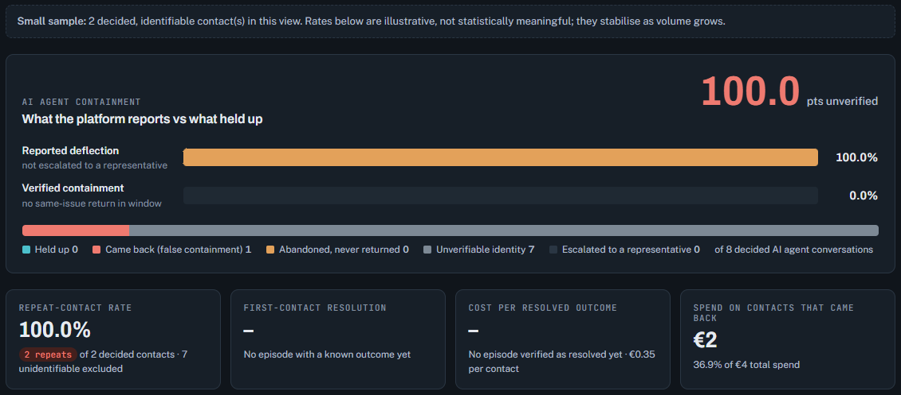
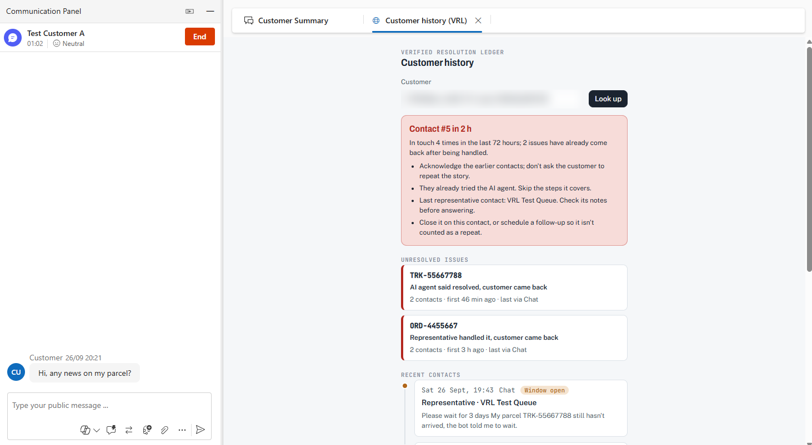
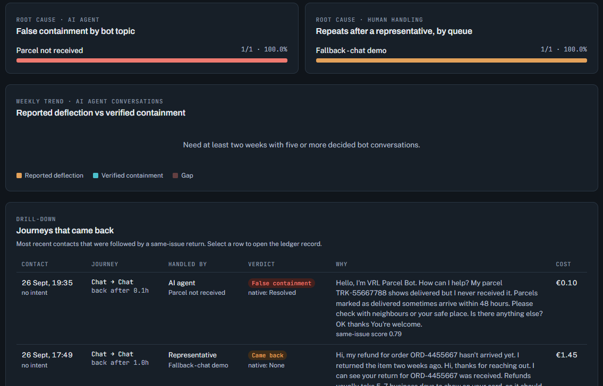
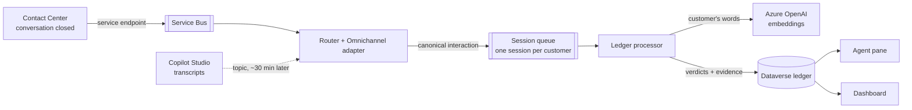

# Verified Resolution Ledger

**Did the contact actually solve the customer's problem?** An open-source accelerator for Dynamics 365 Contact Center
that answers that question for every AI-agent, chat, voice and case contact, and puts the answer in front of the
representative and the supervisor.

> Contact Center counts every conversation an AI agent handled without escalation as *deflected*. In our live test the
> same conversation was *deflected* in Contact Center, *abandoned* in Copilot Studio analytics, and in reality a failure:
> the customer came back about the same parcel seven minutes later. The ledger records the third answer.



## What it does

The ledger links each closed contact to what happened next. If the same customer came back about the same issue within
the repeat window (72 hours by default), the earlier contact did not resolve it:

| Verdict | Meaning |
|---|---|
| **False containment** | The AI agent handled it alone, and the customer came back about the same issue |
| **Failed human resolution** | A representative handled it, and the customer came back |
| **Verified resolved** | No same-issue return within the window |
| **Planned follow-up** | Came back, but the representative had scheduled it |
| **Unknown** | The customer can't be identified reliably, or abandoned the AI agent and never returned. Never counted as resolved |
| **Pending** | The window is still open |

From those verdicts it reports **verified containment next to reported deflection**, a **repeat-contact rate**,
**first-contact resolution derived from data** (not surveys), **cost per resolved outcome**, and **root causes**:
the AI-agent topic and the queue whose contacts come back ([KPI definitions](docs/KPI-Definitions.md)).

**For representatives**: a *Customer history* tab in the Copilot Service workspace opens with each conversation. It
shows unresolved issues and what already failed before the representative says hello, with the evidence behind every
verdict.



**For supervisors**: where false containment comes from, by AI-agent topic and by queue, and each journey that came back.



## How it decides "same issue"

An explainable additive score, compared to a threshold of 0.60. Every link stores its evidence, so any verdict can be
audited by a supervisor or a works council:

| Signal | Weight |
|---|---|
| Same case | +0.70 |
| Same intent / same intent family / conflicting families | +0.60 / +0.30 / −0.30 |
| Shared structured reference (`ORD-4455667`, `TRK-55667788`, a VIN) | +0.50 |
| Shared bare number (7–12 digits; the linked contact's own phone numbers are redacted first) | +0.35 |
| Semantic similarity of **the customer's own words** (Azure OpenAI `text-embedding-3-small`) | up to +0.65, above a per-model floor |

A shared reference alone is deliberately **below** the threshold: the same order can carry two different issues.
Text similarity alone needs a cosine of about 0.96, so in practice it always needs corroboration. The design favours
precision: false "came back" verdicts erode trust faster than misses ([calibration](docs/Calibration.md)).

## Validated on a live Contact Center environment

Real conversations through Contact Center, Dataverse, Service Bus, Azure Functions and Azure OpenAI
([full record](docs/VALIDATION.md)):

| Scenario | Ledger verdict | Evidence |
|---|---|---|
| Refund chat with a representative; customer returns an hour later | **Failed human resolution** | `ORD-4455667` + text similarity 0.754 → **0.83** |
| AI agent answers a missing-parcel chat; customer returns 7 minutes later | **False containment**, topic *Parcel not received* | `TRK-55667788` + text similarity 0.721 → **0.79** |
| The parcel chats compared with the refund chats | Kept as separate issues | highest cross-issue score 0.17 |
| Seven anonymous chats stuck with a demo bot | **Unknown**, excluded from repeat and FCR rates | no reliable identity. Contact Center counted all seven as deflected |

On a labelled synthetic benchmark (600 customers, 30 days), verified containment was **51.5%** against a true
containment of 52.3%, while native deflection reported 80.2%. Repeat detection: **93.7% precision, 76.1% recall**.

## Architecture



A pure, deterministic engine (`Vrl.Core`, no I/O) behind adapters. Per-customer Service Bus sessions give ordered,
lock-free processing that scales out across customers. Upserts are replay-safe. Azure resources use managed identity.
The secrets are the client secret the Function uses to reach Dataverse across tenants (kept in Key Vault), a Send-only
Service Bus key held by the Dataverse service endpoint, and the HTTP API's function key. None is ever printed
([security](SECURITY.md)). Details:
[architecture](docs/ARCHITECTURE.md), [data model](docs/Data-Model.md), [live integration](docs/LIVE-INTEGRATION.md).

## Get started

**Try the engine locally**, without Azure or Dataverse:

```powershell
dotnet test
dotnet run --project tools/Vrl.Tools -- simulate --customers 600 --days 30 --out out
node webresources/build.mjs --demo out/dashboard-demo.json --demo-out artifacts/demo   # open artifacts/demo/dashboard.html
```

**Install into Contact Center**:
1. Copy `deploy\config.example.json` to `deploy\config.json` and fill it in.
2. Put the release's managed solution in `artifacts\solution\`.
3. Run `Deploy.cmd`.

Then do the ten-minute admin-center setup for the agent pane. See the **[installation guide](docs/INSTALL.md)**
(prerequisites, managed and source modes, upgrade, uninstall, troubleshooting).

## Repository

```
src/Vrl.Core          Engine: identity, same-issue scoring, episodes, verdicts, costing, KPIs, synthetic generator (no I/O)
src/Vrl.Dataverse     Schema provisioner, repository, Omnichannel adapter, transcript and Copilot Studio parsers
src/Vrl.AI            Azure OpenAI embedding provider (managed identity)
src/Vrl.Functions     Azure Functions: event router, per-customer processor, maturation and topic timers, HTTP ingestion
tools/Vrl.Tools       `vrl` CLI: simulate, provision, package, import-solution, reingest, explain, diagnostics
webresources/         Agent pane and supervisor dashboard
infra/main.bicep      Flex Consumption Functions, Service Bus, Storage, Key Vault, App Insights, managed identity, RBAC
deploy/               Config-driven deployment, packaging and operations scripts (+ the *.cmd launchers in the root)
tests/                52 xUnit tests, including real (anonymised) Contact Center and Copilot Studio transcripts
```

## Status and limits

Version 1.0 is validated end to end on a Contact Center trial and on synthetic data. It is not yet validated at
production volume. Read [known limits](docs/LIMITATIONS.md) before relying on the KPIs: calibrate the weights on
your own labelled sample, identify customers in AI-agent conversations, and review [security](SECURITY.md) with
your DPO.

## Disclaimer

A community accelerator, **not a Microsoft product** and not supported by Microsoft. Dynamics 365, Copilot Studio,
Dataverse and Azure are trademarks of Microsoft. Provided under the [MIT licence](LICENSE), without warranty.
