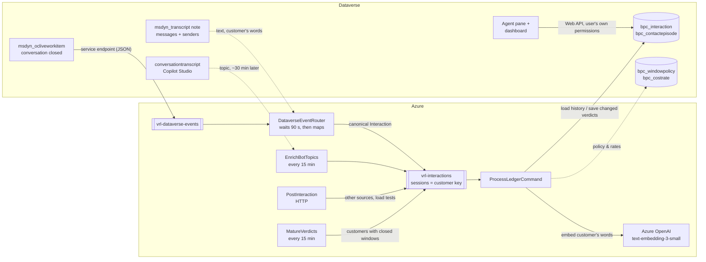

# Architecture

## Flow

## Key decisions

| Decision | Why |
|---|---|
| **Canonical `bpc_interaction` table**, fed by adapters | The engine is independent of the source schema: Omnichannel, Copilot Studio, embedded Salesforce/ServiceNow and synthetic data all normalise into one shape. Writing into system-managed Omnichannel tables is not needed. |
| **Pure engine (`Vrl.Core`)** | Deterministic and free of I/O, so it can be unit-tested and reused from Functions, a Fabric notebook or a plug-in. |
| **Service Bus sessions keyed by customer** | Ordered, exclusive processing per customer with no distributed locks. Different customers scale out in parallel, up to `maxConcurrentSessions` × instances. |
| **Deterministic v5 GUIDs** for interactions and episodes | Upserts are replay-safe. Retries, backfills and duplicate events converge on the same rows. |
| **Write only what changed**, in `ExecuteTransaction` batches | Only changed interaction rows are written, plus the customer's episodes when anything changed, in batches of up to 200 requests. Reduces pressure on Dataverse service-protection limits. A failed batch is retried by Service Bus and converges, because re-evaluation is deterministic and skips rows already written. (CLI replays don't retry automatically: re-run them.) |
| **Verdicts mature** (Pending → final) | A contact cannot be called resolved until its window closes. A timer re-queues due customers into their own sessions, so maturation never races with ingestion. |
| **Explainable additive scoring** | Every link stores its signals as JSON (`bpc_verdictreason`): same case, exact intent, intent family, intent conflict (negative), shared reference, semantic cosine. Supervisors and works councils can audit each verdict. |
| **Per-model semantic calibration** | Cosine distributions differ by embedding model (`SimilarityWeights.ForEmbeddingModel`). The model ID is stored with each vector, so vectors from different models are never compared. |
| **Conservative verdicts** | Silent bot abandonment → *Unknown*, not resolved. No reliable identity → *Unknown*. Scheduled follow-ups → *PlannedFollowUp*, not a failure. |
| **Managed identity wherever the platform allows** | Storage (shared keys off), Service Bus, Key Vault, Azure OpenAI and App Insights use a user-assigned managed identity. Dataverse in another Entra tenant can't accept it, so that hop uses an app registration whose secret is created straight into Key Vault. The Dataverse service endpoint needs a Send-only SAS key. See [SECURITY.md](../SECURITY.md). |
| **Transcripts as the text source** | The Omnichannel transcript note gives the full conversation for display and, through its sender fields (`isFromAgent`, tags), the customer's own words for similarity. Bot boilerplate otherwise dominates short AI-agent chats. |
| **Participants decide bot vs human** | Each session participant is classified by its system user (`msdyn_botapplicationid`). The bot's user is also the conversation's "active agent", so conversation-level flags would turn every AI-agent chat into "bot then human". |
| **Late enrichment, not events, for Copilot Studio** | Copilot Studio writes its transcript when the bot session ends (~30 min). A timer re-maps recent AI-agent conversations without a topic, instead of a Dataverse event on transcript creation, which would post the whole transcript to Service Bus (256 KB message limit). Re-publishes carry a distinct message id, so duplicate detection (30 min) doesn't drop them. |

## Identity and privacy

- Partition key: `contact:<id>` (High confidence), authenticated external ID (High), e-mail (Medium), phone (Medium), account (Low).
  Phone numbers and e-mail addresses are **hashed** (SHA-256, truncated, unsalted: pseudonymisation, see SECURITY.md). The ledger
  never stores raw phone numbers or e-mail addresses.
- An anonymous conversation with no linked contact can be linked through a **self-declared e-mail**, from a pre-chat answer or a
  message **the customer** typed, that matches exactly one active contact's `emailaddress1`, at Medium confidence. The address
  is used for the lookup only.
- Text is redacted before it is queued or stored: e-mail addresses, card-like digit runs, and the linked contact's own phone numbers.
- Identities with more than 250 contacts in the horizon (switchboards, shared mailboxes, test contacts) are treated as unreliable and are not linked.
- Lookups use `RemoveLink` cascade. Deleting a contact (GDPR erasure) removes the link but keeps the ledger rows, which still hold
  the contact id in the customer key and free text in the summary. For full erasure, delete the rows by customer key.
- Representative-level views are aggregated by queue by design. Keep individual agent scoring out of this accelerator.

## Scalability notes

- History load is one indexed query per customer (`bpc_customerkey` + date). Add `bpc_customerkey` to the Quick Find view so
  Dataverse builds an index at volume.
- At more than about 50k contacts per day, move reporting to **Fabric Link** (`ChangeTrackingEnabled` is set on the tables) and
  build a Power BI model on the lakehouse (not included) with the [KPI definitions](KPI-Definitions.md). The dashboard web
  resource caps client-side aggregation at 50k rows.
- Embedding cost is one call per contact, on the customer's words (or the summary). Vectors are 512-d, about 2.7 KB of base64 per row.

## Calibration

The weights are engineering defaults. See [Calibration.md](Calibration.md) for the scoring model and the procedure.
