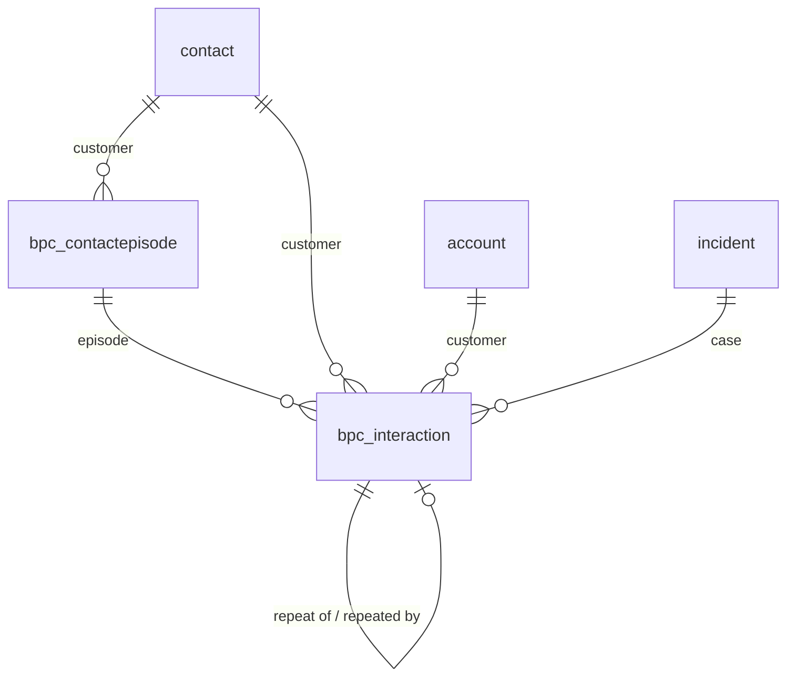

# Data model

Derived from `src/Vrl.Dataverse/Schema/SchemaDefinition.cs` and `LedgerSchema.cs`, the single source of truth for
logical names; if they disagree, the code wins. The provisioner, the adapter, the web resources and any Power BI model use these names. Publisher
prefix: `bpc`. Solution: `VerifiedResolutionLedger`.

All tables are user-owned, have change tracking enabled (for Fabric Link / Synapse Link), and use *remove
link* on delete for every lookup: deleting a contact, account or case keeps the pseudonymised ledger rows.

## Relationships

## Tables

### `bpc_interaction`: Ledger Interaction

| Column | Type | Description |
|---|---|---|
| `bpc_sourcesystem` | Text | omnichannel, copilotstudio, case, salesforce, synthetic… |
| `bpc_sourcerecordid` | Text | Primary key in the source system |
| `bpc_channel` | Choice | Normalised channel |
| `bpc_handlingmode` | Choice | Bot only, bot then human, human only, case only |
| `bpc_nativebotoutcome` | Choice | What the source platform reported |
| `bpc_startedon` | DateTime | Interaction start (UTC) |
| `bpc_endedon` | DateTime | Interaction end (UTC) |
| `bpc_contactid` | Lookup → `contact` | Identified contact, when known |
| `bpc_accountid` | Lookup → `account` | Identified account, when known |
| `bpc_customerkey` | Text | Pseudonymous partition key (hashed for phone/e-mail) |
| `bpc_identityconfidence` | Choice | How reliable the customer key is |
| `bpc_intentcode` | Text | Specific intent code |
| `bpc_intentfamily` | Text | Parent intent / category |
| `bpc_dispositioncode` | Text | Wrap-up / disposition code |
| `bpc_caseid` | Lookup → `incident` | Linked case |
| `bpc_summary` | Memo | Redacted conversation text or Copilot summary (display, reference matching) |
| `bpc_queuename` | Text | Queue name at close |
| `bpc_bottopic` | Text | Last business topic the Copilot Studio agent recognised |
| `bpc_knowledgearticleid` | Text | Knowledge article used, if any |
| `bpc_followupscheduled` | Boolean | Representative deliberately scheduled a follow-up |
| `bpc_botminutes` | Decimal | Minutes with the AI agent |
| `bpc_handleminutes` | Decimal | Human handle time in minutes |
| `bpc_telephonyminutes` | Decimal | Billable telephony minutes |
| `bpc_aicredits` | Decimal | Copilot credits consumed |
| `bpc_embedding` | Memo | Base64 float32 embedding of the customer's words (or the summary) |
| `bpc_embeddingmodel` | Text | Model that produced the embedding |
| `bpc_episodeid` | Lookup → `bpc_contactepisode` | Contact episode |
| `bpc_episodekey` | Text | Deterministic episode key |
| `bpc_predecessorid` | Lookup → `bpc_interaction` | Earlier interaction this one repeats |
| `bpc_successorid` | Lookup → `bpc_interaction` | Later interaction that repeated this one |
| `bpc_predecessorscore` | Decimal | Score of the link to the predecessor |
| `bpc_verdict` | Choice | Verified outcome |
| `bpc_verdictfinal` | Boolean | True once the verdict can no longer change |
| `bpc_verdictcode` | Text | Machine-readable reason |
| `bpc_verdictreason` | Memo | JSON explanation with contributing signals |
| `bpc_windowcloseson` | DateTime | When the repeat window closes |
| `bpc_evaluatedon` | DateTime | Last evaluation time |
| `bpc_engineversion` | Text | Engine version that produced the verdict |
| `bpc_costai` | Decimal | AI credit cost |
| `bpc_costtelephony` | Decimal | Telephony cost |
| `bpc_costlabor` | Decimal | Loaded labor cost |
| `bpc_costtotal` | Decimal | Total cost |

Alternate key `bpc_sourcekey`: `bpc_sourcesystem`, `bpc_sourcerecordid`

### `bpc_contactepisode`: Contact Episode

| Column | Type | Description |
|---|---|---|
| `bpc_episodekey` | Text | Deterministic key |
| `bpc_customerkey` | Text | Pseudonymous customer key |
| `bpc_contactid` | Lookup → `contact` | Identified contact |
| `bpc_status` | Choice | Open, resolved, unresolved, unknown |
| `bpc_contactcount` | Integer | Number of contacts in the episode |
| `bpc_firststartedon` | DateTime | Start of first contact |
| `bpc_lastendedon` | DateTime | End of last contact |
| `bpc_totalcost` | Decimal | Sum of member interaction costs |
| `bpc_rootcauseintent` | Text | Intent of the first failed contact (the first contact's, if none failed) |
| `bpc_rootcausetopic` | Text | Bot topic of the first failed contact (empty if none failed) |
| `bpc_rootcausequeue` | Text | Queue of the first failed contact (empty if none failed) |
| `bpc_channels` | Text | Channels involved |
| `bpc_engineversion` | Text | Engine version |

Alternate key `bpc_episodekey_key`: `bpc_episodekey`

### `bpc_windowpolicy`: Repeat Window Policy

| Column | Type | Description |
|---|---|---|
| `bpc_scope` | Choice | Global, channel or intent family |
| `bpc_channel` | Choice | Channel for channel-scoped rules |
| `bpc_intentfamily` | Text | Intent family for intent-scoped rules |
| `bpc_windowhours` | Integer | Repeat window in hours |
| `bpc_sameissuethreshold` | Decimal | Global rule only: score threshold (0–1) |

### `bpc_costrate`: Cost Rate

| Column | Type | Description |
|---|---|---|
| `bpc_ratetype` | Choice | Credit price, telephony/min, labor/hour, channel/min |
| `bpc_channel` | Choice | Channel for channel rates |
| `bpc_queuename` | Text | Queue for queue-specific labor rates |
| `bpc_amount` | Decimal | Rate amount |
| `bpc_currencycode` | Text | ISO currency code, e.g. EUR |

## Choices

| Choice | Values |
|---|---|
| `bpc_channel` (global) | Unknown, Chat, Voice, SMS, Email, Social, Case |
| Handling mode | Unknown, BotOnly, BotThenHuman, HumanOnly, CaseOnly |
| Native bot outcome | None, Resolved, ResolvedImplied, Escalated, Abandoned |
| Verdict | Pending, VerifiedResolved, FalseContainment, FailedHumanResolution, PlannedFollowUp, Unknown |
| Identity confidence | None, Low, Medium, High |
| Episode status | Open, Resolved, Unresolved, Unknown |
| Policy scope (`bpc_windowpolicy`) | Global, Channel, IntentFamily |
| Rate type (`bpc_costrate`) | CreditPrice, TelephonyPerMinute, LaborPerHour, ChannelPerMinute |

Option values start at 100,000,000, in the order listed. They're persisted and referenced by reports, so never
renumber them.
